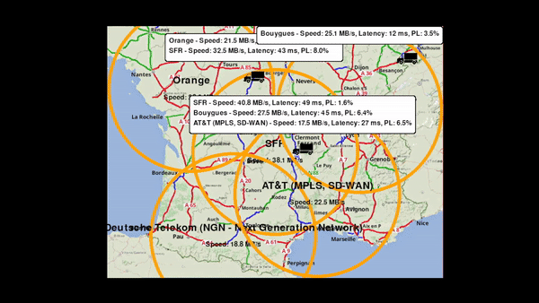
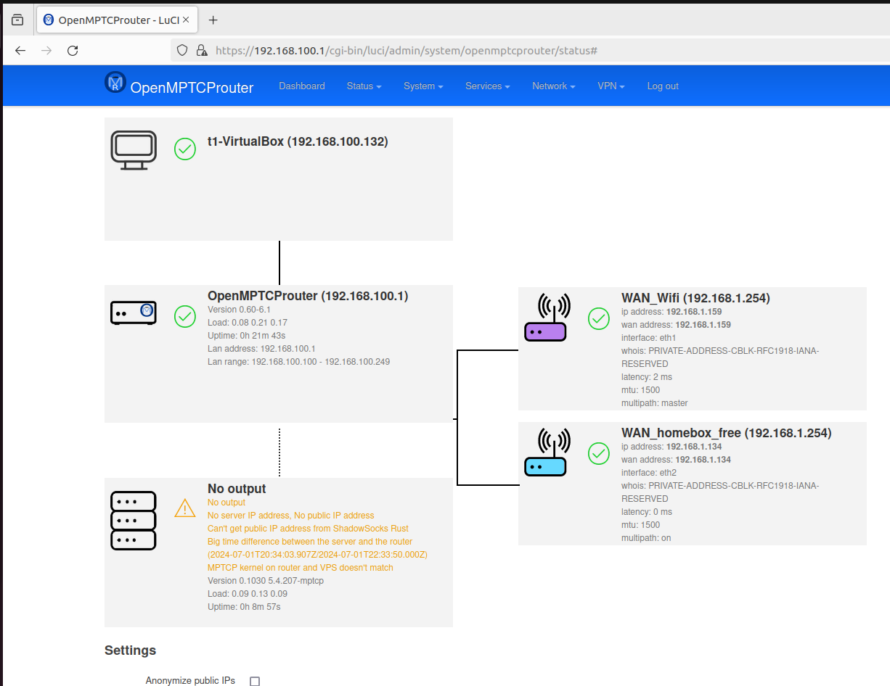

# Design Document: Vehicle Position Transmission via MPTCP on an Embedded System

## Table of Contents

1. [Introduction](#introduction)
2. [Project Objectives](#project-objectives)
3. [System Architecture](#system-architecture)
4. [Hardware and Software Requirements](#hardware-and-software-requirements)
5. [Implementation Details](#implementation-details)
   1. [Hardware Setup](#hardware-setup)
   2. [MPTCP Installation](#mptcp-installation)
   3. [GPS Application Development](#gps-application-development)
   4. [Data Transmission via MPTCP](#data-transmission-via-mptcp)
6. [Deployment and Testing](#deployment-and-testing)
7. [Performance Analysis and Optimization](#performance-analysis-and-optimization)
8. [Resources and References](#resources-and-references)

## Introduction

This document details the design for an embedded system project utilizing MultiPath TCP (MPTCP) to transmit the GPS position of a vehicle in real-time. MPTCP enhances the reliability and continuity of data transmission by using multiple network paths. Specifically, we will use the OpenMPTCP implementation of MPTCP for this project.

## Project Objectives

- Integrate MPTCP into an embedded system to utilize multiple network paths for transmitting data.
- Capture and continuously send the vehicle's GPS position.
- Ensure robust communication through automatic path failover and load balancing with MPTCP.

## System Architecture

### Multiple Trucks Communicating Positions


*Figure: Multiple trucks transmitting their positions to a central server using MPTCP.*

### OpenMPTCP Working


*Figure: Demonstration of OpenMPTCP managing multiple network connections.*

### Key Components

1. **Embedded System:**
   - A development board (e.g., Raspberry Pi, BeagleBone Black, or similar).
   - GPS module.
   - Multiple network interfaces (Wi-Fi, 4G/5G modems).

2. **Communication Protocol:**
   - MPTCP to manage multiple network connections.

3. **GPS Application:**
   - Software to read GPS data and send it via MPTCP to a remote server.

4. **Receiving Server:**
   - A remote server to receive and store the transmitted GPS data.

## Hardware and Software Requirements

### Hardware

- **Development Board:** Raspberry Pi, BeagleBone Black, or equivalent.
- **GPS Module:** Compatible with UART or USB (e.g., U-blox NEO-6M).
- **Network Interfaces:** Multiple connections (4G/5G modems, Wi-Fi, Ethernet).

### Software

- **Operating System:** Linux distribution compatible with MPTCP (e.g., Raspbian with OpenMPTCP support).
- **GPS Software:** `gpsd` and associated libraries.
- **Development Tools:** Python, C, or other programming languages.
- **Receiving Server:** HTTP or TCP server to receive GPS data.

## Implementation Details

### Hardware Setup

1. **Operating System Installation:**
   - Download and install a Linux distribution on the development board that supports MPTCP, such as Raspbian with OpenMPTCP enhancements.

2. **Peripheral Connections:**
   - Connect the GPS module to the board via UART or USB.
   - Configure multiple network interfaces (4G/5G modems, Wi-Fi, Ethernet).

### MPTCP Installation

1. **Download and Compilation:**
   - Obtain the OpenMPTCP version of the Linux kernel, which provides enhanced support for MPTCP features.
   - Compile and install this kernel on the development board.

2. **MPTCP Configuration:**
   - Enable MPTCP in the network configuration settings.
   - Ensure all network interfaces are available and configured for MPTCP use.

### GPS Application Development

1. **GPS Data Reading:**
   - Use `gpsd` to read data from the GPS module.
   - Develop a script in Python or C to capture the GPS position data.

2. **MPTCP Data Transmission:**
   - Implement an MPTCP client to send GPS data to a remote server.
   - Use MPTCP sockets to manage multiple network connections effectively.

### Data Transmission via MPTCP

```python
import socket
import gps

# GPS client configuration
session = gps.gps(mode=gps.WATCH_ENABLE | gps.WATCH_NEWSTYLE)

# Server address for GPS data reception
server_address = ('server_ip', port_number)

# Create an MPTCP socket
s = socket.socket(socket.AF_INET, socket.SOCK_STREAM)
s.connect(server_address)

while True:
    try:
        report = session.next()
        if report['class'] == 'TPV':
            latitude = report.lat
            longitude = report.lon
            # Send GPS data to the server
            data = f"{latitude},{longitude}\n"
            s.sendall(data.encode('utf-8'))
    except KeyError:
        pass
    except KeyboardInterrupt:
        break
    except StopIteration:
        session = None
        print("GPSD has stopped")

s.close()
